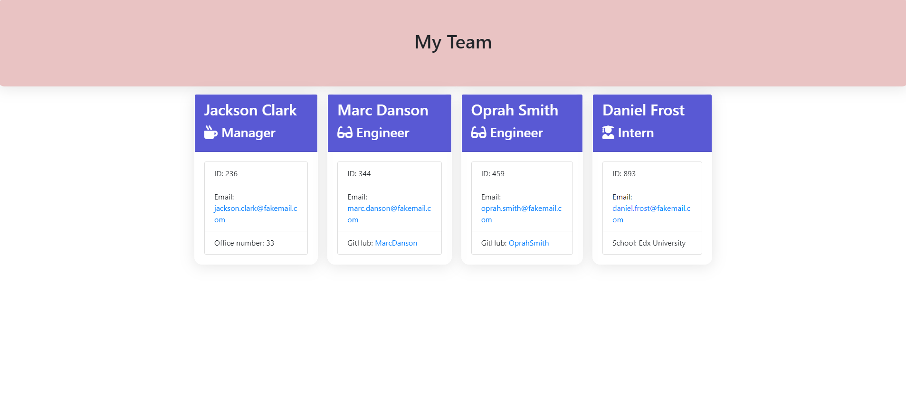

# Team Details Generator


## Description 

This Application takes in information about employees on a software engineering team, then generates an HTML webpage that displays summaries for each person.


## Table of Contents


* [Installation](#installation)
* [Usage](#usage)
* [License](#license)
* [Contributions](#Contributions)
* [Test](#Test)


## Installation

The application should use [Jest](https://www.npmjs.com/package/jest) for running the unit tests and [Inquirer](https://www.npmjs.com/package/inquirer) for collecting input from the user.


## Usage 

This application is used to provide a clear summary of members in team and it is all displayed online.

The application will be invoked by using the following command:

```bash
node index.js
```

Your application mock-up should be as the following example.



## License

The license used is: MIT


## Contributions

If you wish to contribute, please contact me on eiteltchapdeu@gmail.com.


## Tests

To test the application, make sure you have installed jest and use the following command:

```bash
npm run test
```


---

© 2024 edX Boot Camps LLC. Confidential and Proprietary. All Rights Reserved.